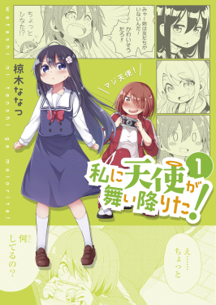
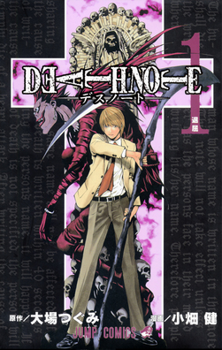

# Manga

- [Manga Items](#manga-items)
  - [Is the Order a Rabbit?](#is-the-order-a-rabbit)
  - [Wataten!](#wataten)
  - [Death Note](#death-note)
- [Keyword Index](#keyword-index)

## Manga Items

### Is the Order a Rabbit?

> see [Is the Order a Rabbit? - Wikipedia](https://en.wikipedia.org/wiki/Is_the_Order_a_Rabbit%3F)

Is the Order a Rabbit? (Japanese: ご注文はうさぎですか?, Hepburn: Gochūmon wa Usagi desu ka?), often abbreviated as GochiUsa (ごちうさ), is a Japanese four-panel manga series written and illustrated by Koi. The series has been serialized in Houbunsha's Manga Time Kirara Max magazine since March 2011 and the chapters collected into twelve tankōbon volumes as of May 2024. The manga was released in Indonesia by Elex Media Komputindo. An anime television series adaptation animated by White Fox aired in Japan between April and June 2014. A second season by White Fox and Kinema Citrus aired in Japan between October and December 2015. Two OVA films animated by production doA were released in November 2017 and September 2019. A third anime season by Encourage Films aired in Japan between October and December 2020. A new anime project has been announced.

keywords: lolicon, yuri

### Wataten!

> see [Wataten! - Wikipedia](https://en.wikipedia.org/wiki/Wataten!)

Wataten!: An Angel Flew Down to Me (Japanese: 私に天使が舞い降りた!, Hepburn: Watashi ni Tenshi ga Maiorita!) is a Japanese four-panel yuri comedy manga series written and illustrated by Nanatsu Mukunoki. The series began publication in Ichijinsha's Comic Yuri Hime magazine in November 2016. An anime television series adaptation produced by Doga Kobo aired in Japan between January and March 2019. A theatrical anime film titled Wataten!: An Angel Flew Down to Me: Precious Friends premiered in October 2022.

keywords: lolicon, yuri

### Death Note

> see [Death Note - Wikipedia](https://en.wikipedia.org/wiki/Death_Note)

Death Note is a Japanese manga series written by Tsugumi Ohba and illustrated by Takeshi Obata. It was serialized in Shueisha's shōnen manga magazine Weekly Shōnen Jump from December 2003 to May 2006, with its chapters collected in 12 tankōbon volumes. The story follows Light Yagami, a genius high school student who discovers a mysterious notebook, the Death Note, which belonged to the shinigami Ryuk and kills anyone whose name is written in its pages. The series centers on Light's use of the Death Note to carry out a worldwide massacre of individuals he deems immoral to create a crime-free society, using the alias of a god-like vigilante named Kira, and the efforts of an elite Japanese police task force, led by the detective L, to apprehend him.

keywords: detective

## Keyword Index
- by-assembly-keyword
  - lolicon, yuri
    - [Is the Order a Rabbit?](#is-the-order-a-rabbit)
    - [Wataten!](#wataten)
- by-keyword
  - lolicon
    - [Is the Order a Rabbit?](#is-the-order-a-rabbit)
    - [Wataten!](#wataten)
  - yuri
    - [Is the Order a Rabbit?](#is-the-order-a-rabbit)
    - [Wataten!](#wataten)
  - detective
    - [Death Note](#death-note)
